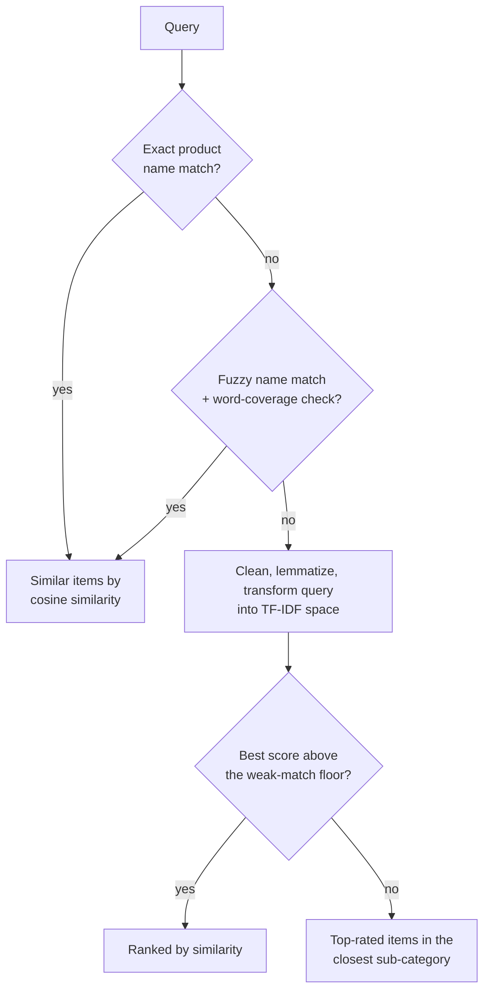

# BigBasket AI Recommender

Content-based product search over the BigBasket catalog (23,449 products),
served through a Flask API with a minimalist dark frontend. Retrieval is
TF-IDF + cosine similarity with three fallback tiers underneath it, so a
search only comes back empty if the catalog itself has nothing left to
offer.


## How search works



`api/recommender.py` is the actual source of truth for this - its module
docstring walks through why each tier exists and what it hands off to the
next. The short version: tier 2 (fuzzy name matching) rejects a lot of its
own candidates that a plain string-distance score would accept, because
with 23k product names, something will always look coincidentally similar
to a totally unrelated query; a word-level coverage check is what actually
tells "typo of a real title" apart from "unrelated string that happens to
align well."

Catalog cleaning and the TF-IDF fit both happen offline, in
`notebooks/Content_Based_NLP_Recommendation_Engine.ipynb` plus the rebuild
documented in `models/README.md`. The API loads the resulting artifacts
once at startup - including a one-time lemmatizer warmup so the first real
search doesn't pay for it - and every request after that is a lookup and a
similarity computation, not a re-fit.

## Project structure

```
bigbasket-recommender/
├── api/
│   ├── main.py           # Flask routes only
│   ├── recommender.py    # ProductRecommender: the four-tier search
│   └── text_utils.py     # Shared query/catalog text cleaning
├── models/
│   ├── df_recommender.pkl
│   ├── tfidf_matrix.pkl
│   ├── tfidf_vectorizer.pkl
│   └── README.md
├── nltk_data/             # Wordnet corpus, shipped so builds don't need it over the network
├── templates/
│   └── index.html
├── static/
│   ├── style.css
│   └── script.js
├── notebooks/
│   └── Content_Based_NLP_Recommendation_Engine.ipynb
├── requirements.txt
├── render.yaml
└── LICENSE
```

## Running locally

```bash
python -m venv venv
source venv/bin/activate          # venv\Scripts\activate on Windows
pip install -r requirements.txt
python -m api.main
```

Visit `http://127.0.0.1:5000`.

## Deploying to Render

1. Push this repository to GitHub.
2. In the Render dashboard, choose **New > Blueprint** and point it at the
   repo - Render reads `render.yaml` and provisions the service
   automatically (free plan, health check on `/health`).
3. Configuring by hand instead: **New > Web Service**, build command
   `pip install -r requirements.txt`, start command
   `gunicorn --workers 1 --threads 4 api.main:app`.
4. Wait for the build to finish, then open the assigned `onrender.com` URL.

Render's free instances spin down after periods of inactivity, so the
first request after a quiet stretch takes a few extra seconds to wake up.

## Tech stack

Flask · scikit-learn (TF-IDF, cosine similarity) · rapidfuzz · NLTK
(lemmatization) · pandas · joblib · gunicorn · vanilla HTML/CSS/JS · Render

## Author

**Abhishek Grover**
[Portfolio](https://abhishekgroverai.netlify.app) ·
[GitHub](https://github.com/AbhishekGrover1) ·
[LinkedIn](https://www.linkedin.com/in/abhishek-grover07)

## License

MIT - see [LICENSE](LICENSE).
